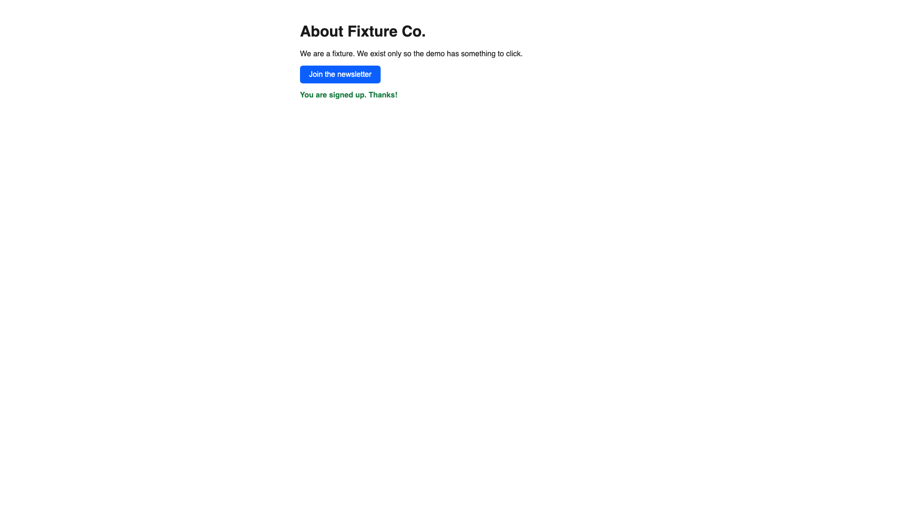
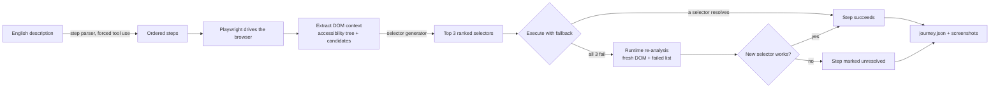

# Self-Healing Browser Agent

[](https://github.com/25andresbernal/self-healing-browser-agent/actions/workflows/ci.yml)
[](LICENSE)

Describe a browser journey in plain English. Claude turns it into steps, Playwright
drives a real browser through them, and when a selector breaks the agent looks at the
live page and fixes itself instead of failing the run.

## Why it exists

Scripted browser journeys break for one reason more than any other: the selector a
human picked no longer matches the page. A redesign renames a class, a framework
regenerates an id, a QA engineer swaps a button for a `<div>` with an onClick handler,
and the automation that depended on `nav > ul > li:nth-child(3) > a` starts failing on
every run until someone opens dev tools, finds the new element, and edits the script by
hand. On any team running synthetic monitoring or end-to-end tests against a product
that ships often, this is the single largest source of false-positive failures and the
single largest source of maintenance time.

This project treats selector fragility as the problem to solve, not a fact of life.
Instead of one hand-picked selector per step, an LLM looks at the live DOM and produces
three independent ways to find the same element, ranked by how likely each one is to
survive a redesign. If the top selector breaks, the runner falls back to the next one.
If all three break, the agent asks the LLM to look at the current page and try again,
so the journey heals itself instead of just failing.

## Demo

`journey-agent demo` runs the full pipeline with no API key and no network access. It
drives real headless Chromium through a bundled two-page fixture site
(`examples/site/`) using a `FakeLLM` with a canned step parse and canned selector
rankings, and one step is seeded to fail so you can see the healing path fire for real.

```
$ journey-agent demo

[demo] run_id: demo-20260924-103553
[demo] model : fake-demo-v1  (FakeLLM -- no API key or network used)
[demo] site  : .../examples/site

English description:
  Open the Fixture Co. home page, click the About link, click the newsletter signup button, then verify the confirmation message appears.

[demo] parsing natural-language steps (canned)...
[demo] parsed 4 step(s)
  1. [navigate] the fixture site home page  = '.../examples/site/index.html'
  2. [click] About link in the navigation
  3. [click] Join the newsletter button
  4. [verify] newsletter signup confirmation message

[OK ] step 1: Navigate: the fixture site home page
[OK ] step 2: Click: About link in the navigation  -> [data-testid='about-link']
[browser] step 3: all 3 selectors failed, attempting runtime re-analysis...
[OK  (healed)] step 3: Click: Join the newsletter button  -> [data-testid='signup-button']
[OK ] step 4: Verify: newsletter signup confirmation message  -> [data-testid='signup-confirmation']

[demo] wrote journey.json -> output/demo/journey.json

============================================================
RUN SUMMARY
============================================================
  total steps        : 4
  resolved           : 4
  unresolved         : 0
  healed at runtime  : 1
  avg stability      : high
  model              : fake-demo-v1
  run_id             : demo-20260924-103553
============================================================

[demo] the newsletter-button step failed on all 3 seeded selectors and was healed
by a runtime re-analysis call -- see step 3 above (healed) and the journey.json
'healed' field.
```

Step 3's three canned selectors are all stale on purpose (as if a redesign had
renamed the button's `data-testid`). Every fallback misses, the pipeline calls the
selector generator a second time with the live DOM and the list of what failed, and
the new selector it returns resolves. Here is the actual page after that healed step
ran, screenshotted mid-run by the agent:



## Architecture



## Quick start

Requires Python 3.10+ and [uv](https://docs.astral.sh/uv/).

```bash
git clone https://github.com/25andresbernal/self-healing-browser-agent.git
cd self-healing-browser-agent
uv venv --python 3.12
uv pip install -e ".[dev]"
uv run playwright install chromium

# no API key needed for this one
uv run journey-agent demo
```

To build a journey against a real site, set `ANTHROPIC_API_KEY` (see
`.env.example`) and run:

```bash
export ANTHROPIC_API_KEY=sk-ant-...
uv run journey-agent build \
  --url "https://example.com" \
  --steps "Navigate to example.com, click the More information link" \
  --output output/example.json
```

Re-run an existing journey later, with the same self-healing behavior, to check
whether the site still matches what was recorded:

```bash
uv run journey-agent run --journey output/example.json
```

## Configuration

All configuration is environment variables (see `.env.example`) or CLI flags.

| Variable | Required | Default | Used by |
|---|---|---|---|
| `ANTHROPIC_API_KEY` | Yes, for `build` and `run` | none | step parser, selector generator |
| `ANTHROPIC_MODEL` | No | `claude-sonnet-5` | overridable per-command with `--model` |

| Command | Flags |
|---|---|
| `journey-agent build` | `--url` (required), `--steps` / `--steps-file`, `--output`, `--journey-name`, `--model`, `--headful`, `--no-screenshots`, `--no-auto-dismiss` |
| `journey-agent run` | `--journey` (required), `--output`, `--model`, `--headful`, `--no-screenshots`, `--no-auto-dismiss` |
| `journey-agent demo` | `--output`, `--headful`, `--no-screenshots` |

`journey-agent demo` never touches the network: it is wired to `FakeLLM`, a canned
stand-in for the Anthropic client used throughout the test suite.

## How it works

1. **Parse.** `step_parser.py` sends the English description to Claude with a forced
   tool call, and gets back an ordered list of atomic steps (`navigate`, `click`,
   `input`, `select`, `check`, `uncheck`, `wait`, `verify`), each with a natural-language
   target description.
2. **Drive.** `browser_engine.py` wraps Playwright: adaptive waits, cookie-banner and
   consent-modal auto-dismissal, visibility and scroll-into-view checks before every
   action, and a catch-all per step so one bad step never crashes the whole run.
3. **Extract DOM context.** `dom_extractor.py` builds a compact snapshot for the LLM:
   an accessibility-tree outline plus a short list of visible elements whose text or
   attributes plausibly match the target description, each with its attributes and a
   parent chain.
4. **Rank selectors.** `selector_generator.py` asks Claude for exactly three selectors
   for the target, ordered most-stable-first, using the stability criteria in
   `prompts.py`: test-intent `data-*` attributes first, then ARIA/accessibility
   attributes, then meaningful ids, then unique visible text, then structural CSS as a
   last resort.
5. **Execute with fallback.** The runner tries each ranked selector in order and stops
   at the first one that works.
6. **Heal.** If all three fail, the engine re-extracts the live DOM and asks Claude for
   a fresh ranked list, explicitly telling it which selectors already failed. If one of
   the new selectors resolves, the step is marked `healed: true`.
7. **Emit.** `journey_io.py` writes `journey.json` with every step's full ranked
   selector list, which one actually ran, whether it was healed, a screenshot path, and
   run-level metadata (resolved/unresolved/healed counts, average predicted stability).

### journey.json schema

```json
{
  "journey_name": "Example flow",
  "generated_at": "2026-04-09T14:30:17Z",
  "target_url": "https://example.com",
  "steps": [
    {
      "step_number": 2,
      "action_name": "Click: Sign In button in the top navigation",
      "action_type": "click",
      "target_description": "Sign In button in the top navigation",
      "value": null,
      "identifiers": [
        { "type": "css", "value": "[data-testid='login-button']", "stability": "high", "is_primary": true },
        { "type": "css", "value": "button[aria-label='Sign In']", "stability": "high", "is_primary": false },
        { "type": "xpath", "value": "//nav//button[contains(text(),'Sign In')]", "stability": "medium", "is_primary": false }
      ],
      "screenshot_path": "output/screenshots/20260409-143017-ab12ef/step_02.png",
      "status": "resolved",
      "healed": false,
      "error": null
    }
  ],
  "metadata": {
    "total_steps": 4,
    "resolved_steps": 4,
    "unresolved_steps": 0,
    "healed_steps": 1,
    "average_selector_stability": "high",
    "browser": "chromium",
    "viewport": "1920x1080",
    "model": "claude-sonnet-5",
    "run_id": "20260409-143017-ab12ef"
  }
}
```

`action_type` is one of `navigate`, `click`, `input`, `select`, `check`, `uncheck`,
`wait`, `verify`. `identifiers` is the full ranked candidate list the selector
generator produced for that step (all of them, not just the one that ran), so a
`journey-agent run` later has the whole fallback chain to work with, and a healed step
carries both the selectors that failed and the ones the re-analysis produced.

### Adapters

`journey.json` is intentionally not tied to any one synthetic-monitoring or
test-automation product. Mapping it into another tool's format is a matter of walking
`steps[]` and translating two things: `action_type` onto that tool's action vocabulary
(most tools have a near-1:1 equivalent for navigate/click/input/select/check/uncheck),
and `identifiers[]` onto however that tool represents a located element -- a single
selector, an ordered fallback list, or a locator object. `is_primary` tells you which
identifier to use if the target format only accepts one; the full ranked list is there
if it accepts more.

## Design decisions

- **Three ranked selectors, not one.** A single hand-picked selector is a single point
  of failure. Three independent strategies (test attribute, accessibility attribute,
  structural/text fallback) mean a step usually survives a redesign without ever
  invoking the LLM again. The cost is more tokens per step at build time; the payoff is
  fewer runs that need healing at all.
- **An accessibility-tree outline instead of raw HTML.** Raw page source for a modern
  site is often hundreds of kilobytes and mostly irrelevant to any one step. The
  accessibility tree plus a short list of scored candidate elements gives the model the
  same semantic information a human would use to find the element, at a fraction of the
  token cost, and keeps selector-generation latency and spend predictable per step.
- **Runtime re-analysis is a last resort, capped at one extra call.** Healing is
  useful precisely because it is rare: if every step needed it, the ranking step would
  be failing at its job. Bounding it to one re-analysis per failing step keeps API cost
  bounded and keeps a truly broken step from retrying forever; it comes back as
  `unresolved` instead.
- **The output is a portable JSON file, not a vendor payload.** Coupling the schema to
  one monitoring product's API would make the tool useless to anyone not on that
  product. A plain, documented JSON schema with an explicit adapters story is more
  useful as a portfolio piece and more useful in practice: any team can write a
  20-line adapter for their own stack.
- **A FakeLLM instead of mocking the Anthropic SDK in every test.** The step parser and
  selector generator only ever call one method shape
  (`client.messages.create(...)` returning tool-use blocks). Writing that shape once as
  a scriptable fake, instead of patching the SDK in each test, keeps the tests reading
  like specifications of behavior (parse this, rank that, heal this) instead of mock
  plumbing, and it doubles as the offline demo.

## Roadmap

- Adapter modules for one or two concrete synthetic-monitoring/test-automation tools,
  not just the documented mapping.
- iframe and shadow-DOM traversal in the DOM extractor.
- A `--diff` mode for `journey-agent run` that reports which steps changed selectors
  since the journey was last built, even when nothing broke.
- Parallel step-level screenshots as a short GIF for the demo, instead of a single
  static frame.

## Contributing

Issues and pull requests are welcome. Before opening a PR:

```bash
uv run ruff check .
uv run ruff format .
uv run pytest -q
```

## License

MIT. See [LICENSE](LICENSE).
